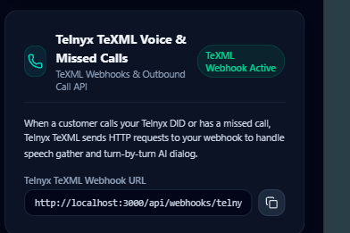

# Aura Voice — Missed Call AI Assistant SaaS Platform

A generic, production-minded AI receptionist SaaS platform designed for small businesses (Cake Shops, Real Estate Agencies, Clinics, Delivery Businesses, Repair Services, and more).

When a business misses a customer call, Aura Voice automatically triggers an AI callback, conducts a structured conversation, extracts custom dynamic fields, evaluates workflow rules and priority conditions, executes approved external tools (such as Google Calendar), and records the full interaction in the business dashboard.

---

## 🌟 Key Features

1. **Generic Architecture (Zero Hardcoded Industries)**
   - Businesses, workflows, dynamic fields, conditions, and tool actions are defined entirely through data configurations.
   - The same conversational AI engine handles a Cake Shop order inquiry, a Real Estate lead qualification, or any new industry without modifying backend AI logic.

2. **Google Calendar Tool Integration**
   - Implements four real calendar tools:
     - `check_calendar_availability`
     - `create_calendar_event`
     - `update_calendar_event`
     - `cancel_calendar_event`
   - Gemini decides when to call calendar tools via structured tool/function calling.

3. **Interactive Text & Audio Simulator**
   - Test interactions end-to-end directly in the web browser.
   - Features a **Developer & Audit Debug Panel** displaying extracted fields live, workflow completion progress, evaluated rule conditions, and tool call audit trails.
   - Built-in Speech Synthesis audio playback for a real phone call experience.

4. **Bilingual Support (English & Hindi)**
   - Language-neutral workflow schemas with localized greetings, dynamic question prompts, and closing statements in English and Hindi.

5. **Multi-Tenant Dashboard & Audit Feed**
   - High-conversion SaaS dashboard with priority filters (`normal`, `high`, `urgent`), customer intent tracking, AI summaries, follow-up status toggles (`pending`, `contacted`, `completed`, `closed`), and call transcripts.

6. **Twilio Telephony & Pipecat Voice Architecture**
   - Webhook handler for missed call lifecycle (`MISSED`, `CALLBACK_QUEUED`, `CALLBACK_INITIATED`, `CONNECTED`, `COMPLETED`).
   - Architecture prepared for Pipecat worker orchestration with Deepgram STT, Gemini LLM, and ElevenLabs TTS.

---

## 🚀 Technology Stack

- **Framework**: Next.js 15 (App Router, TypeScript)
- **Styling**: Tailwind CSS, Vanilla CSS Glassmorphism
- **Database**: PostgreSQL / Supabase SQL Schema (with zero-setup in-memory fallback for immediate local testing)
- **AI Engine**: Gemini 3 (`@google/genai`) with structured function calling
- **Telephony & Voice**: Twilio SDK, Pipecat Orchestrator Architecture (Deepgram STT, ElevenLabs TTS)
- **Calendar**: Google Calendar API (googleapis, OAuth 2.0)
- **Authentication**: JWT Cookie Session Auth (`demo@auravoice.ai` / `demo123`)

---

## 🛠️ Local Setup & Quick Start

1. **Install Dependencies**:
   ```bash
   npm install
   ```

2. **Environment Variables**:
   Copy `.env.example` to `.env.local` and add your API keys if available:
   ```bash
   cp .env.example .env.local
   ```
   *(Note: The platform is fully functional in zero-setup demo mode even without external API keys!)*

3. **Run Development Server**:
   ```bash
   npm run dev
   ```
   Open [http://localhost:3000](http://localhost:3000) in your browser.

---

## 🔑 Environment Variables Template (.env.example)

```text
NEXT_PUBLIC_APP_URL=http://localhost:3000

SUPABASE_URL=
SUPABASE_ANON_KEY=
SUPABASE_SERVICE_ROLE_KEY=

GEMINI_API_KEY=



DEEPGRAM_API_KEY=
ELEVENLABS_API_KEY=

GOOGLE_CLIENT_ID=
GOOGLE_CLIENT_SECRET=
GOOGLE_REDIRECT_URI=http://localhost:3000/api/calendar/callback
JWT_SECRET=aura_voice_super_secret_demo_key_2026
```

---

## 📁 Project Structure

```text
src/
├── app/
│   ├── page.tsx                    # Main SaaS Dashboard & Audit Feed
│   ├── workflows/page.tsx           # Generic Workflow & Field Builder
│   ├── simulator/page.tsx           # Interactive AI Text & Voice Simulator
│   ├── conversations/[id]/page.tsx # Conversation Transcript & Tool Detail
│   ├── integrations/page.tsx       # Google Calendar OAuth & Telephony Setup
│   └── api/                        # Backend REST endpoints
├── components/
│   ├── Sidebar.tsx                 # Multi-tenant business selector
│   └── Navbar.tsx                  # System status bar & demo reset
├── lib/
│   ├── auth/                       # Authentication & tenant authorization
│   ├── db/                         # Supabase client & in-memory fallback
│   ├── engine/                     # Generic Workflow Engine (Conditions, Prompts, Field Extraction)
│   ├── services/                   # Gemini, Google Calendar, Twilio, Pipecat
│   └── tools/                      # Central Tool Registry
```
