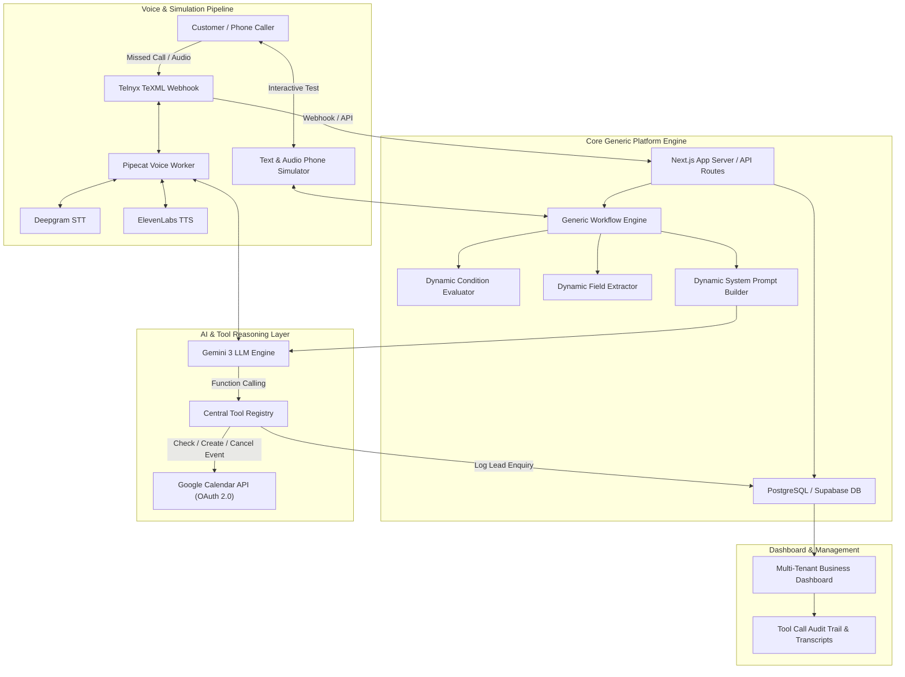

# System Architecture & Flow — Aura Voice

## Overview

Aura Voice is structured around a **generic workflow core**. The AI receptionist does not hardcode business domain logic. Instead, business rules, question sequences, field extractions, priority conditions, and approved tool capabilities are loaded dynamically at runtime.

---

## Mermaid Architecture Diagram

---

## Component Boundaries

1. **Next.js Web / API Layer**: Handles web dashboard rendering, workflow editing, user authentication, and REST API handlers.
2. **Generic Workflow Engine**: Executes dynamic field extraction (`field-extractor.ts`), evaluates condition rules (`conditions.ts`), and synthesizes custom prompt instructions (`prompt-builder.ts`).
3. **Gemini 3 LLM Engine**: Receives system prompts and handles natural language conversation while triggering native function calls.
4. **Central Tool Registry**: Authorizes and runs external tool operations (`check_calendar_availability`, `create_calendar_event`, `create_customer_enquiry`) while persisting audit records.
5. **Voice Pipeline (Pipecat Worker)**: Manages real-time WebSockets/RTP audio streams connecting Telnyx, Deepgram STT, Gemini 3, and ElevenLabs TTS.
